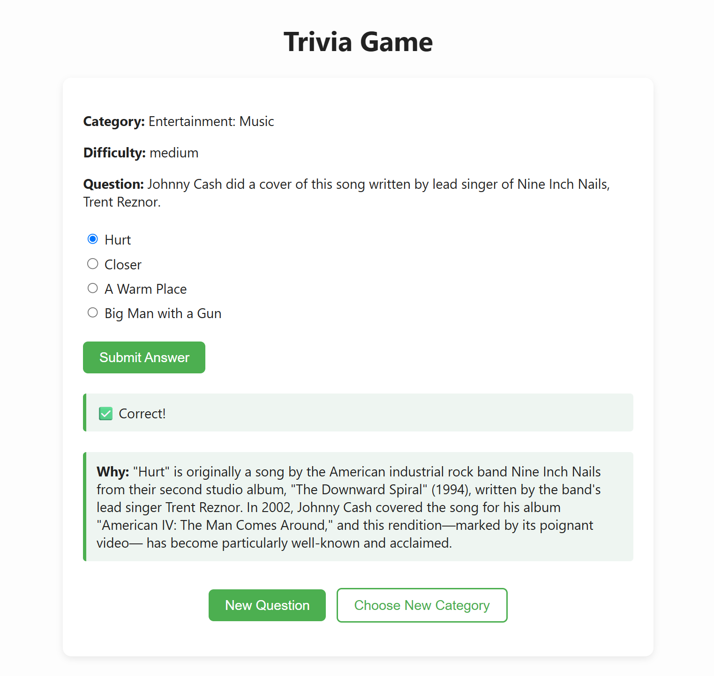

# AI-Powered Trivia Game

An interactive, web-based trivia game built with Python, Quart, HTML, and the OpenAI API. Users can choose trivia categories and difficulty levels, answer randomized multiple-choice questions, and receive instant feedback with GPT-powered explanations of the correct answers.

---

## Features

- Question bank from [Open Trivia DB API](https://opentdb.com/api_config.php)
- Selction menu offers dropdown category selection menu and question difficulty choice (easy, medium, or hard)
- AI explanations implemented using an OpenAI API Key (incorporperated through a dotenv file for security)
- "New Question" and "Choose New Category" buttons for fast replay
- Clean, minimalist HTML UI.

---

## Screenshots

### Category & Difficulty Selection  

### Correct Answer Example  

### Incorrect Answer Example  

> More screenshots located in the `/Assets/` folder

---
