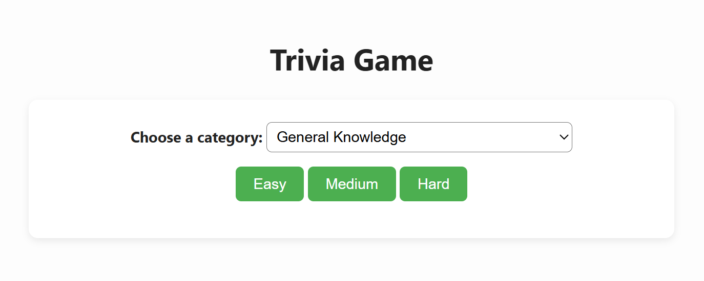
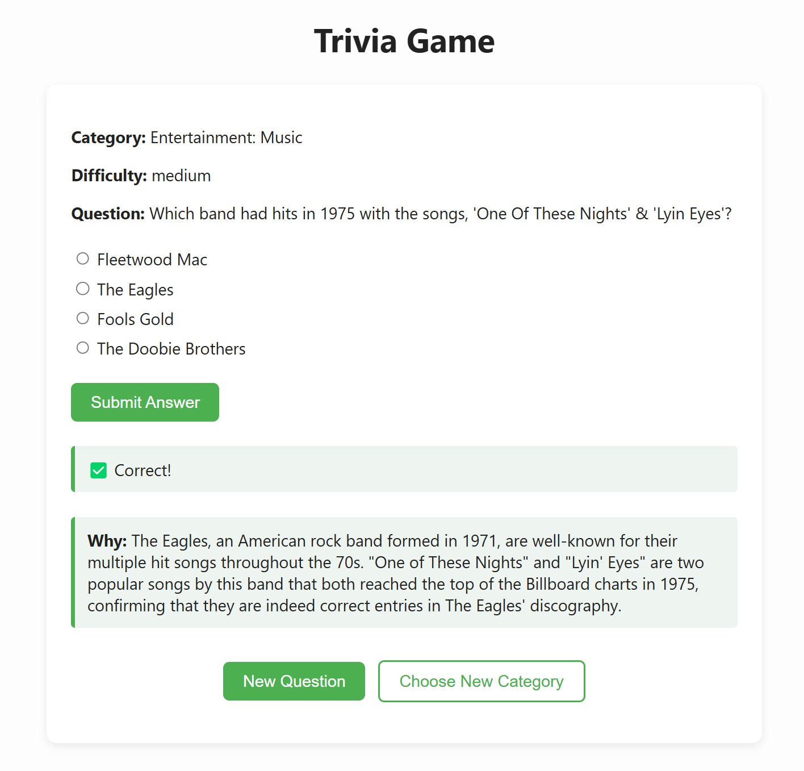
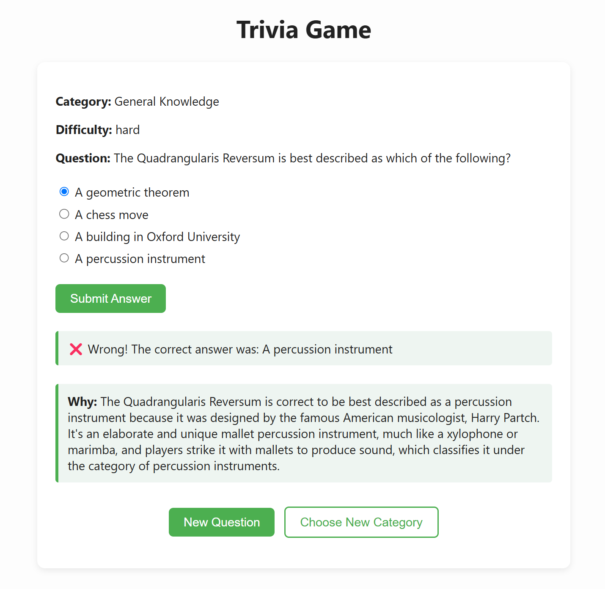

# AI-Powered Trivia Game

An interactive, web-based trivia game built with Python, Quart, HTML, and the OpenAI API. Users can choose trivia categories and difficulty levels, answer randomized multiple-choice questions, and receive instant feedback with GPT-powered explanations of the correct answers.

---

## Features

- Difficulty selection: Easy, Medium, Hard
- Category selection from the full Open Trivia DB API
- AI explanations using OpenAI GPT-4
- "New Question" and "Choose New Category" buttons for fast replay
- Clean, minimalist HTML UI.

---

## 🖼️ Screenshots

### 🧠 Category & Difficulty Selection  

### 🟢 Correct Answer Example  


### 🔴 Incorrect Answer Example  


> 📸 All screenshots located in the `/Assets/` folder

---

## 🚀 Getting Started

### 1. Clone the repo

```bash
git clone https://github.com/your-username/ai-trivia-game.git
cd ai-trivia-game
